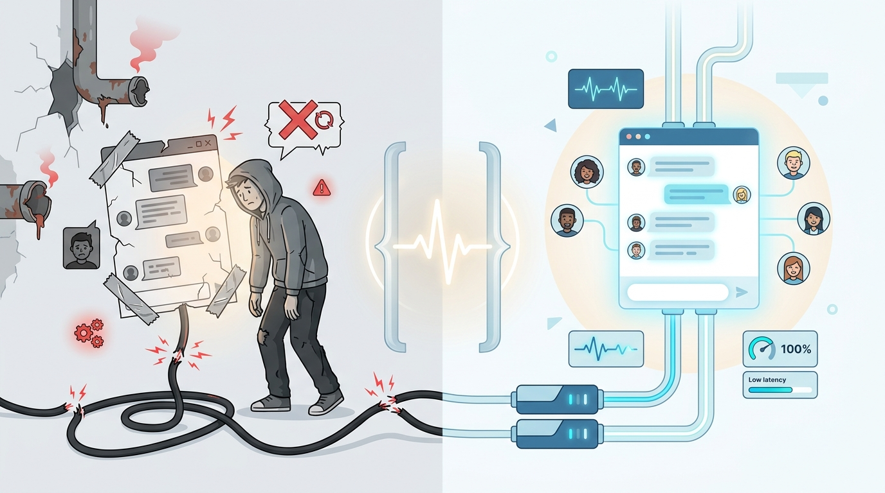
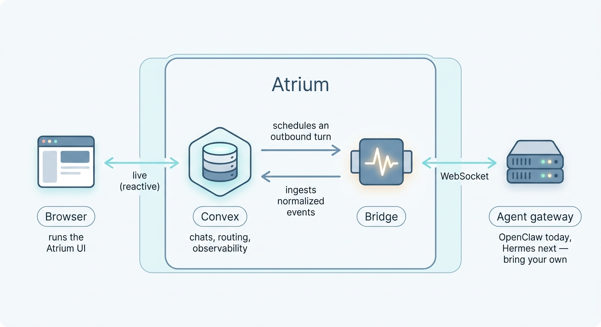

<p align="center">
  <picture>
    <source media="(prefers-color-scheme: dark)" srcset="docs/assets/atrium-mark-dark.svg">
    
  </picture>
</p>

<h1 align="center">Atrium</h1>

<p align="center">A clean, self-hostable, multi-user web chat for your AI agents — one UI across agent gateways.</p>

<p align="center">
  
  
  <!-- After the first push (once CI has run once), uncomment the CI badge:
   -->
</p>

<p align="center">
  
</p>

An open-source, self-hostable web chat UI for **AI agent gateways**. It gives a
team a clean multi-user chat front end across one or more gateways, with streaming
replies, file exchange, per-user agent routing, voice read-aloud and dictation,
and a built-in observability surface. **OpenClaw and Hermes are both supported**
— each provider lives behind a bridge adapter, and the UI is **capability-driven**:
it discovers what a given gateway can do and shows only that, so the same front
end serves either provider without per-provider UI code.

> Atrium is **provider-agnostic by design** and a community project — not
> affiliated with or endorsed by any gateway vendor. You bring your own gateway
> (OpenClaw or Hermes); Atrium is the chat surface in front of it.

## Status

Early but functional, designed as a public, forkable foundation. The project is
`0.x`: the bridge protocol and APIs are documented and versioned, but breaking
changes can still happen before `1.0`.

## What it is

Agent gateways are event-driven and best driven over a WebSocket: a single user
turn can produce multiple runs, intermediate replies, tool output, generated
media, auto-compaction restarts, and messages that arrive after a browser
reconnect. Atrium embraces that model instead of fighting it:

- A **React + Vite** front end (TypeScript, built on assistant-ui).
- A **Convex** self-hosted backend (TypeScript functions + reactive database)
  that owns chats, messages, routing, auth, and the observability data.
- A **Node/TypeScript bridge** with a **per-provider adapter** (OpenClaw and
  Hermes) that holds a persistent connection to the gateway, normalizes the
  version-specific event stream into a small stable shape, and relays turns to
  and from Convex. The provider is the only vendor-coupled layer. Hermes offers
  two transports — a JSON-RPC WebSocket (the default, richer surface) or an
  OpenAI-compatible REST/SSE API — selectable per instance.
- An external **agent gateway** (OpenClaw or Hermes) that actually runs the
  agents. Atrium never runs the model itself — you bring your own gateway.

The front end never parses raw gateway frames; it subscribes to Convex, which is
fed by the bridge. The result is a stable UI even as providers and versions evolve.

<p align="center">
  
</p>

The browser only ever talks to Convex; it has **no** direct connection to the bridge.

See [docs/ARCHITECTURE.md](docs/ARCHITECTURE.md) for the full picture.

## Features

- Google and Microsoft Entra sign-in (via `@convex-dev/auth`), restricted to
  allowed email domains; the first sign-in from an allowed domain becomes admin.
- **Two gateway providers, one UI**: OpenClaw and Hermes, each behind a bridge
  adapter. The UI is capability-driven — it discovers what a gateway supports and
  shows only that, so a control a provider lacks is simply absent rather than
  broken.
- Multi-user, multi-agent, multi-instance routing: each user is routed to the
  gateway instance and agent assigned to them.
- Streaming assistant replies with a stable contract (deltas, snapshots,
  finalize, run status, tool status, media), resilient to provider and version
  differences, empty/duplicate finals, follow-on runs, and auto-compaction.
- **Structured agent activity**: tool calls, delegated sub-agents, and Hermes
  Mixture-of-Agents runs surface as an inline, drill-down monitor — the
  aggregator and its reference models rendered as a hierarchy.
- **Voice**: per-instance read-aloud of replies and microphone dictation. The
  read-aloud engine is chosen per instance — the browser's built-in voices (no
  key, works on any provider) or, on providers that expose a text-to-speech RPC,
  the gateway's own configured TTS voices.
- File exchange in both directions (inbound attachments, outbound generated
  media served from Convex storage — server filesystem paths never reach the
  browser).
- **Agent workspace files** (identity / rules / tools) viewable and editable
  per instance, with concurrent-edit protection.
- A key-authed observability API (`/api/v1`) and an MCP server (`mcp/`) for
  traces, KPIs, anomalies, and diagnostics — metadata only, no chat content.
- Full internationalization (French default, English) via Paraglide JS.

## Quickstart

The frontend and bridge ship as Docker images; Convex runs self-hosted. The
canonical, env-driven deployment guide (Docker Compose and Helm) lives in
[`deploy/`](deploy/):

```bash
cd deploy/compose
cp .env.example .env          # fill every required value (see comments inside)
docker compose up -d          # convex backend + dashboard + frontend + bridge
./bootstrap-env.sh            # push the Convex-scoped vars (auth, bridge wiring)
```

Open the app at your frontend origin and sign in. See
[`deploy/README.md`](deploy/README.md) for the full guide, including the
two-environment-scope gotcha and the stateful/stateless lifecycle.

For local development (no Docker), see [docs/DEVELOPMENT.md](docs/DEVELOPMENT.md).

## Frontend distribution (npm / CDN)

Besides the Docker image, the frontend is published to npm as a **prebuilt static
bundle** ([`@lacneu/atrium`](https://www.npmjs.com/package/@lacneu/atrium)) so you
can deploy the UI to any static host or CDN without building it yourself. It is
**origin-agnostic**: the Convex URL is read at runtime from a `/config.json` served
next to the bundle, so one artifact serves any deployment.

> The bundle is only the UI — you still run the Convex backend and the bridge (see
> [Quickstart](#quickstart)). Serve a `config.json` next to `index.html`:
>
> ```json
> { "convexUrl": "https://convex.example.com" }
> ```

- **npm** — `npm install @lacneu/atrium`, then copy the package's `dist/` to your
  static host / bucket / CDN and drop your `config.json` beside `index.html`.
- **Pin a version straight from a CDN** (e.g. in a deploy script) — no install:
  - `https://unpkg.com/@lacneu/atrium@<version>/dist/`
  - `https://cdn.jsdelivr.net/npm/@lacneu/atrium@<version>/dist/`
- **Docker** — the published frontend image serves the same `dist/` and writes
  `/config.json` from the `CONVEX_URL` env at startup (this is what the Quickstart
  uses).

## Documentation

- [Architecture](docs/ARCHITECTURE.md) — components, data flow, auth.
- [Development](docs/DEVELOPMENT.md) — local dev workflow, tests, Convex, Vite.
- [Configuration](docs/CONFIGURATION.md) — environment variable reference.
- [Bridge protocol](docs/BRIDGE_PROTOCOL.md) — bridge ↔ Convex ↔ gateway contract.
- [Deployment](docs/DEPLOYMENT.md) → points to [`deploy/`](deploy/).
- [Deployment troubleshooting](deploy/TROUBLESHOOTING.md) — first-deploy problems
  with diagnosis + fix (private images, sign-in/JWT, agent discovery, …).
- [OpenClaw version compatibility](docs/OPENCLAW_VERSION_COMPAT.md).
- [Compliance / Trust Center](compliance/) — SOC 2 control mapping (incl. the
  metadata-only `/api/v1` surface) + the software-vs-operator
  shared-responsibility model.
- [Vision](VISION.md) · [Changelog](CHANGELOG.md) ·
  [Third-party notices](THIRD_PARTY_NOTICES.md) ·
  [Contributing & agent guide](AGENTS.md).

## Security

Gateway tokens and device identities live only in the bridge process — never in
Convex tables and never in the browser. Outbound media is served through Convex
storage with no server paths exposed. See [SECURITY.md](SECURITY.md).

## Contributing

Contributions are welcome — see [CONTRIBUTING.md](CONTRIBUTING.md) and the
[Code of Conduct](CODE_OF_CONDUCT.md).

## License

MIT. See [LICENSE](LICENSE).
